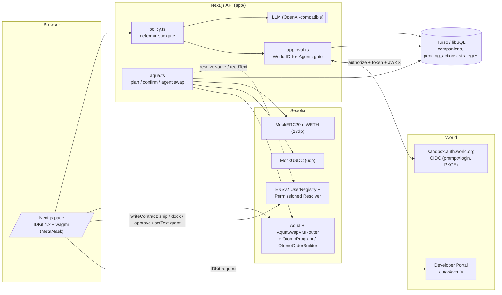

# Otomo

**English summary:** Otomo ("companion" in Japanese) gives every verified human exactly one AI companion. Its name and permissions live on ENSv2 (a non-transferable subname with a dedicated Permissioned Resolver), its allowance for AMM strategies is managed by 1inch Aqua + SwapVM **without funds ever leaving the owner's wallet**, and every consequential action requires a fresh face-level approval via World ID for Agents (OIDC `prompt=login`). One human, one companion — enforced by World Selfie Check nullifiers.

---

## Otomo とは

Otomo は、World ID の Selfie Check で本人確認した人間に1体だけ生まれる「相棒」です。相棒の名前は ENSv2 のサブネーム（`<label>.otomo.eth`）として発行され、譲渡不可・永続的に持ち主に紐付きます。相棒はチャットで依頼を受けますが、LLM の出力は権限になりません — 送金・運用・外部依頼などの重要な操作はすべて、決定的なポリシーコードで判定され、World ID for Agents による**その場の顔での承認**を通った時だけ実行されます。

資金運用には 1inch Aqua + SwapVM を使います。ユーザー（maker）が `aqua.ship` で戦略を登録しても資金はウォレットから出ず、Aqua が仮想残高を記録するだけです。第三者のスワップが成立した瞬間にだけトークンが移動し、0.3% の手数料が相棒の戦略に積み上がります。

## 3分デモの流れ

1. **誕生**: `/` で MetaMask 接続 → 「顔で誕生させる」。World IDKit（Selfie Check, action=`otomo-birth`, signal=ウォレットアドレス）→ サーバーが `developer.world.org/api/v4/verify/{rp_id}` で検証 → nullifier 未使用を確認 → 相棒専用の Permissioned Resolver をデプロイし、`<label>.otomo.eth` を UserRegistry に登録（譲渡不可）。
2. **契り**: 「World ID で契りを結ぶ」→ World ID for Agents（OIDC sandbox）で初回ログイン。`sub` を相棒に紐付け、以後の承認はこの `sub` 一致が前提。
3. **チャット**: `/otomo/<label>` で相棒と話す。「気分を変えて」は ENS の `otomo.mood` に相棒鍵で即書き込み（権限はこの1キーのみ）。
4. **「お金を増やして」**: LLM が `grow_savings` intent を返す → ポリシーが残高を確認 → `pending_actions` に保存（5分TTL）→ 「顔で承認する」で `prompt=login` 再認証 → サーバーが運用計画（strategy）を `ready` で保存。
5. **ship**: ページの「承認して運用を始める（MetaMask）」→ approve（不足時のみ）→ `aqua.ship`。**資金はウォレットに残ったまま**、画面で「ウォレット残高 / Aqua が預かっている額（仮想）」が並びます。
6. **デモスワップ**: 「相棒に取引を受けさせる（デモ）」で agent 鍵が第三者 taker として `router.swap` — maker のウォレットから直接 mUSDC が出て、mWETH（手数料込み）が入ります。
7. **dock**: 「運用をやめる」でユーザーが `aqua.dock` — 仮想残高がゼロになり戦略終了。

承認を拒否した場合・期限（5分）切れ・別人の `sub`・古い `auth_time`・state 不一致の場合は、いずれも**何も実行されません**（`tests/approval.test.ts` で網羅）。

## アーキテクチャ



## スポンサー技術

### World — Best Use of IDKit / Best Use of World ID for Agents

- **Selfie Check（credential 11）を選んだ理由**: Orb 不要で World ID App だけで使える medium assurance。「1人に1体」は nullifier（`used_nullifiers` テーブル）で担保し、顔画像・生体情報はアプリに一切届きません（検証は Developer Portal 側）。`WORLD_SYBIL_MAX` で sybil_score 超過の誕生を拒否できます。
- **バックエンド検証**: RP 署名は [`app/src/app/api/world/rp-signature/route.ts`](app/src/app/api/world/rp-signature/route.ts)、proof 検証は [`app/src/app/api/birth/route.ts`](app/src/app/api/birth/route.ts) が `POST https://developer.world.org/api/v4/verify/{rp_id}` に委譲。順序: verify 成功 → signal 一致 → nullifier 未使用 → sybil 判定。
- **World ID for Agents（OIDC sandbox）**: 重要操作は [`app/src/lib/approval.ts`](app/src/lib/approval.ts) + [`app/src/app/api/approval/callback/route.ts`](app/src/app/api/approval/callback/route.ts) で「その場の本人確認」。`prompt=login&max_age=0`、PKCE S256、JWKS で iss/aud/exp/nonce 検証、`auth_time >= action.created_at`、pairwise `sub` が契りの sub と一致した時だけ実行。
- **失敗パス**: キャンセル・期限切れ（5分）・別人・古い auth_time・state リプレイはすべて rejected/expired で**実行されない**こと — [`app/tests/approval.test.ts`](app/tests/approval.test.ts)（8件）。

### ENS — Best Use of ENSv2

- ENSv2 が中核: 相棒 = 名前空間。親名 `otomo.eth`（ETHRegistrar commit-reveal で取得）配下に、相棒ごとに VerifiableFactory で UserRegistry + 専用 Permissioned Resolver をデプロイし `register` します（[`app/scripts/setup-parent.ts`](app/scripts/setup-parent.ts)、[`app/src/lib/chain.ts`](app/src/lib/chain.ts) `issueCompanionName`）。
- **譲渡不可**: `COMPANION_ROLE_BITMAP = ROLE_SET_RESOLVER | ROLE_SET_RESOLVER_ADMIN`（[`app/src/lib/ens.ts`](app/src/lib/ens.ts)）。`ROLE_CAN_TRANSFER_ADMIN` を付けないため、相棒の名前は売却・譲渡できません。
- **最小権限**: resolver の `grants` は持ち主に `ALL_ROLES`（`0x1111…` 64ニブル）のみ。agent 鍵には `grantSetterRoles(encodeFunctionData(setText, [name, "otomo.mood", ""]))` で `otomo.mood` キーの `setText` だけを許可（SPEC-1 §2.4a の仮説は init calls 内で検証可能にしてあり、`ENS_GRANT_AGENT_IN_INIT` で切替）。
- Sepolia (ENSv2 Beta) の確定アドレスは [`docs/research.md`](docs/research.md) を正とします。

### 1inch — Build an Aqua App

- **非カストディアル運用**: `aqua.ship` は仮想残高の記録だけで資金は移動しません。スワップ成立時に `pull`/`push` で直接移動、`dock` で残高ゼロ。UI でウォレット残高と仮想残高を並べて示します。
- **SwapVM プログラム**: `Deadline → FlatFeeAmountIn(0.3%) → XYCSwap → Salt`（[`contracts/src/OtomoProgram.sol`](contracts/src/OtomoProgram.sol)、順序は swap-vm `docs/PROGRAMS.md` に準拠）。手数料 `0.003e9` = 0.3%（`BPS = 1e9`）。
- **公式契約を改変せず**: pinned commit で取得（[`contracts/script/install-deps.sh`](contracts/script/install-deps.sh)、commit 一覧は [`contracts/README.md`](contracts/README.md)）。
- **証跡**: ローカル anvil での ship→quote→swap→dock ログは [`contracts/evidence/demo.log`](contracts/evidence/demo.log)。オンチェーンヘルパー [`contracts/src/OtomoOrderBuilder.sol`](contracts/src/OtomoOrderBuilder.sol) で trait パッキングを TS 再実装せずに済ませています。
- **Sepolia デプロイ**: `contracts/script/DeploySepolia.s.sol`（資金到着後に実行予定、手順は contracts/README.md）。

Powered by Aqua — © Degensoft Ltd 2025. SwapVM — © Degensoft Ltd 2025.
（Aqua / SwapVM を取り込んだ Solidity ファイルは `LicenseRef-Degensoft-Aqua-Source-1.1` / `LicenseRef-Degensoft-SwapVM-1.1` でライセンスされます。`contracts/README.md` と `contracts/lib/*/LICENSES/` 参照）

## セットアップ

前提: Node.js 22、npm、Foundry（`foundryup`）。

```sh
# 1. コントラクト依存（pinned commit を lib/ に取得）
cd contracts && ./script/install-deps.sh && cd ..

# 2. アプリ
cd app
npm install
cp .env.example .env.local   # 値を埋める（下表）
npm run keys:init            # OPERATOR_PRIVATE_KEY / AGENT_PRIVATE_KEY / APP_SECRET を生成・記入

# 3. Sepolia: operator に ETH と MockUSDC を用意して親名セットアップ
npm run setup:parent         # → ENS_USER_REGISTRY を .env.local と app/deployments/sepolia.json に記録

# 4. Aqua スタックを Sepolia にデプロイ（contracts/deployments/sepolia.json を出力）
cd ../contracts
DEPLOYER_PRIVATE_KEY=0x... forge script script/DeploySepolia.s.sol --rpc-url "$SEPOLIA_RPC_URL" --broadcast
# → AQUA_ADDRESS / AQUA_ROUTER_ADDRESS / OTOMO_ORDER_BUILDER_ADDRESS / MOCK_WETH_ADDRESS を .env.local に記入

cd ../app && npm run dev      # http://localhost:3000
```

本番（Vercel）: https://otomo-world-id.vercel.app/

### 環境変数（`app/.env.example`）

| 変数 | 用途 |
| --- | --- |
| `TURSO_DATABASE_URL` / `TURSO_AUTH_TOKEN` | libSQL。未設定ならローカル `file:otomo.db`（Vercel では必須） |
| `NEXT_PUBLIC_WORLD_APP_ID` | Developer Portal の app_id（クライアント公開） |
| `WORLD_RP_ID` / `WORLD_RP_SIGNING_KEY` | Relying Party ID / 署名鍵（サーバーのみ） |
| `NEXT_PUBLIC_WORLD_ENV` | `staging`（開発）/ `production` |
| `WORLD_SYBIL_MAX` | この sybil_score を超える誕生を拒否（未設定=判定しないがログに残す） |
| `AGENT_OIDC_ISSUER` / `_CLIENT_ID` / `_CLIENT_SECRET` / `_REDIRECT_URI` | World ID for Agents（OIDC sandbox） |
| `SEPOLIA_RPC_URL` | Sepolia RPC |
| `OPERATOR_PRIVATE_KEY` | 親名管理・サブネーム登録のガス負担鍵 |
| `AGENT_PRIVATE_KEY` | 相棒の実行鍵。オンチェーンで与えた権限以外は何もできない |
| `ENS_PARENT_LABEL` / `ENS_USER_REGISTRY` | 親名ラベル / setup 出力の UserRegistry |
| `ENS_GRANT_AGENT_IN_INIT` | resolver initialize() の calls 内で mood 権限を付与する仮説の切替 |
| `AQUA_ADDRESS` / `AQUA_ROUTER_ADDRESS` / `OTOMO_ORDER_BUILDER_ADDRESS` / `MOCK_WETH_ADDRESS` | DeploySepolia.s.sol の出力 |
| `LLM_BASE_URL` / `LLM_API_KEY` / `LLM_MODEL` | OpenAI 互換 /chat/completions |
| `APP_SECRET` | セッション Cookie の HMAC 鍵 |

秘密値はすべてサーバーサイドのみ。未設定時はダミーに逃げず、不足変数名を明示してエラーにします（`src/lib/env.ts`）。

## テスト・検証

| コマンド | 結果 |
| --- | --- |
| `cd app && npm test` | vitest 4 ファイル **33 件すべてパス** |
| `cd app && npm run lint` | tsc --noEmit エラーなし |
| `cd app && npm run build` | 成功（`/api/strategies`, `/api/strategies/[id]` 含む全ルート） |
| `cd contracts && forge test` | **7 件すべてパス**（OtomoStrategy 5 + OtomoOrderBuilder 2） |
| `cd contracts && ./script/demo.sh` | anvil で ship→quote→swap→dock の実トークン移動を実演（ログ: `contracts/evidence/demo.log`） |

## 未検証・制限（正直に）

- **Aqua スタックは実 Sepolia では未デプロイ**（operator の Sepolia ETH 待ち）。アプリ側の ship→confirm→demo swap→dock 経路はローカル anvil でのみ実証済みです。
- Selfie Check は厳密な「1人1アカウント」を保証しません（medium assurance）。1体制限は nullifier で担保し、追加のリスク判定に sybil_score を使います。
- 価格はモック想定（2000 USDC/WETH の固定レートで WETH レグを半分に）。モックトークンなので実市場連動ではありません。
- LLM は OpenAI 互換 `/chat/completions` なら任意のプロバイダに差し替え可能。LLM の出力は intent JSON として zod 検証され、ポリシー判定は常に決定的なコード側です。

## ライセンス

- ルート `LICENSE`: **MIT**（© Otomo contributors）。`app/` のコードに適用されます。
- `contracts/` のうち Aqua / SwapVM の公式コードを取り込んだファイルは Degensoft ライセンス（`LicenseRef-Degensoft-Aqua-Source-1.1` / `LicenseRef-Degensoft-SwapVM-1.1`）— 範囲と帰属は [`contracts/README.md`](contracts/README.md) と `contracts/lib/*/LICENSES/` を参照。`contracts/src/mocks/MockERC20.sol` は MIT。

## AI 利用の明記

このプロジェクトは AI エージェント（Devin）とのペア開発で実装されました。仕様・計画・判断資料は `docs/` に、生成コードへのレビューと検証記録はコミット履歴にあります。
